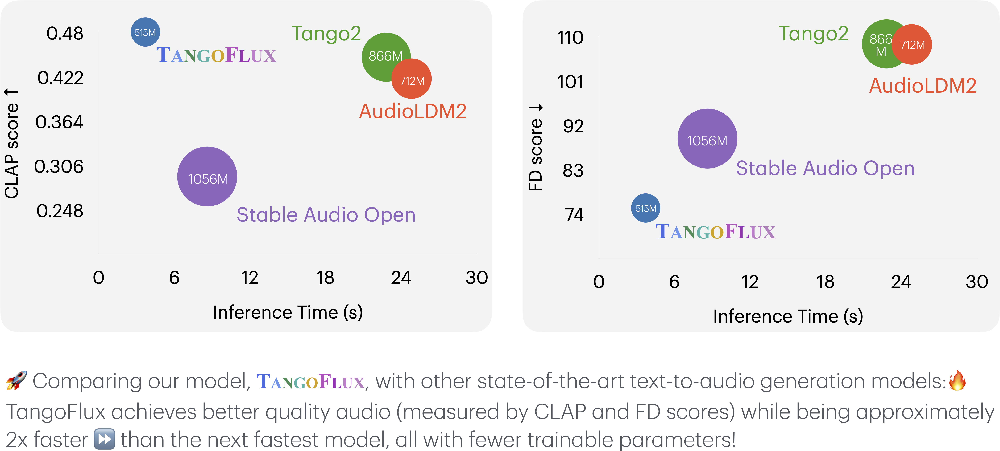
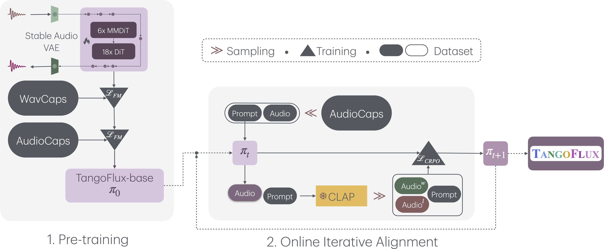

<h1 align="center">✨ 
<br/>  
TangoFlux: Super Fast and Faithful Text to Audio Generation with Flow Matching and Clap-Ranked Preference Optimization 
<br/>
✨✨✨


</h1>

<div align="center">
  

<br/>

[](https://arxiv.org/abs/2412.21037) [](https://huggingface.co/declare-lab/TangoFlux) [](https://tangoflux.github.io/) [](https://huggingface.co/spaces/declare-lab/TangoFlux) [](https://huggingface.co/datasets/declare-lab/CRPO)


</div>

## Quickstart on Google Colab

| Colab |
| --- |
[](https://colab.research.google.com/drive/1j__4fl_BlaVS_225M34d-EKxsVDJPRiR?usp=sharing) 

## Overall Pipeline
TangoFlux consists of FluxTransformer blocks, which are Diffusion Transformers (DiT) and Multimodal Diffusion Transformers (MMDiT) conditioned on textual prompt and duration embedding to generate 44.1kHz audio up to 30 seconds long. TangoFlux learns a rectified flow trajectory to an audio latent representation encoded by a variational autoencoder (VAE). TangoFlux training pipeline consists of three stages: pre-training, fine-tuning, and preference optimization with CRPO. CRPO, particularly, iteratively generates new synthetic data and constructs preference pairs for preference optimization using DPO loss for flow matching.




🚀 **TangoFlux can generate up to 30 seconds long 44.1kHz stereo audios in about 3 seconds.**

## Training TangoFlux
We use the accelerate package from HuggingFace for multi-gpu training. Run accelerate config from terminal and set up your run configuration by the answering the questions asked. We have placed the default accelerator config in the `configs` folder. 

`tangoflux_config` defines the training and model hyperparameters:
```bash
CUDA_VISISBLE_DEVICES=0,1 accelerate launch --config_file='configs/accelerator_config.yaml' src/train.py   --checkpointing_steps="best" --save_every=5 --config='configs/tangoflux_config.yaml'
```
## Inference with TangoFlux
Download the TangoFlux model and generate audio from a text prompt.
TangoFlux can generate audios up to 30 second long through passing in a duration variable in the `model.generate` function.
```python
import torchaudio
from tangoflux import TangoFluxInference
from IPython.display import Audio

model = TangoFluxInference(name='declare-lab/TangoFlux')
audio = model.generate('Hammer slowly hitting the wooden table', steps=50, duration=10)

Audio(data=audio, rate=44100)
```
Our evaluation shows that inferring with 50 steps yield the best results. A CFG scale of 3.5, 4, and 4.5 yield simliar quality output.
For faster inference, consider setting steps to 25 that yield similar audio quality.

## Evaluation Scripts

## TangoFlux vs. Other Audio Generation Models

This key comparison metrics include:

- **Output Length**: Represents the duration of the generated audio.
- **FD**<sub>openl3</sub>: Fréchet Distance.
- **KL**<sub>passt</sub>: KL divergence.
- **CLAP**<sub>score</sub>: Alignment score.


All the inference times are observed on the same A40 GPU. The counts of trainable parameters are reported in the **\#Params** column.

| Model                           | \#Params  | Duration | Steps | FD<sub>openl3</sub> ↓ | KL<sub>passt</sub> ↓ | CLAP<sub>score</sub> ↑ | IS ↑ | Inference Time (s) |
|---------------------------------|-----------|----------|-------|-----------------------|----------------------|------------------------|------|--------------------|
| **AudioLDM 2-large**            | 712M      | 10 sec   | 200   | 108.3                | 1.81                 | 0.419                  | 7.9  | 24.8               |
| **Stable Audio Open**           | 1056M     | 47 sec   | 100   | 89.2                 | 2.58                 | 0.291                  | 9.9  | 8.6                |
| **Tango 2**                     | 866M      | 10 sec   | 200   | 108.4                | **1.11**             | 0.447                  | 9.0  | 22.8               |
| **TangoFlux-base**              | **515M**  | 30 sec   | 50    | 80.2                 | 1.22                 | 0.431                  | 11.7 | **3.7**            |
| **TangoFlux**                   | **515M**  | 30 sec   | 50    | **75.1**             | 1.15                 | **0.480**              | **12.2** | **3.7**         |


## Citation

```bibtex

@article{Hung2025TangoFlux,
  title = {TangoFlux: Super Fast and Faithful Text to Audio Generation with Flow Matching and Clap-Ranked Preference Optimization},
  author = {Chia-Yu Hung and Navonil Majumder and Zhifeng Kong and Ambuj Mehrish and Rafael Valle and Bryan Catanzaro and Soujanya Poria},
  year = {2025},
  url = {https://openreview.net/attachment?id=tpJPlFTyxd&name=pdf},
  note = {Available at OpenReview}
}

```
